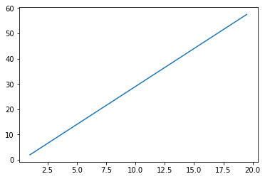
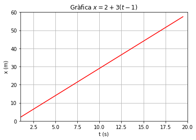

# Moviment: Funcions i representació gràfica

Podeu descarregar aquest notebook fent click [aquí](http://niobio.github.io/fisicacomp/mov/mov1.ipynb) 


## Funcions en Python

Si un mòbil es desplaça amb una velocitat instantània constant diem que té un Moviment Rectilini Uniforme i la seva equació de moviment ve donada per l'expressió

$$x = x_0 + v (t - t_0)$$

on $t$ correspon al temps i és la variable independent, mentre que $x$ correspon a la posició del mòbil i es coneix com variable dependent. Els altres tres paràmetres que apareixen a l'equació són constants i corresponen a l'instant inicial ($t_0$), la posició inicial ($x_0$) i la velocitat ($v$).

L'equació de moviment és una funció que ens dóna la posició del mòbil per a qualsevol instant de temps. Un exemple podria ser:

$$x = 2 + 3 (t - 1)$$

En aquest cas l'equació ens diu que en l'instant $t_0 = 1\,\mathrm{s}$ el mòbil té la posició $x_0 = 2\,\mathrm{m}$ i que porta una velocitat constant $v = 3\,\mathrm{m/s}$.

Amb aquesta equació podem saber quina posició tindrà el mòbil en un temps futur, només cal posar l'instant de temps a l'equació i calcular la posició. Per exemple, a l'instant $t = 5\,\mathrm{s}$ trobarem que 

$$x = 2 + 3 (5 -1) = 14\,\mathrm{m}$$

que serà la posició del mòbil. Això ho podem fer per a qualsevol instant de temps, per tant, amb l'equació de moviment tenim una eina predictiva, que és el que volem sempre quan fem ciència. En física sempre tractem de formular models no només per entendre el que ja coneixem, sinó també per a poder predir el que passarà!

En Python podem crear funcions que ens permetin determinar la posició del mòbil donat l'instant de temps. Per exemple, per a definir la funció del mateix moviment de l'exemple escrivirem el següent codi:


```python
## crearem una funció anomenada mru  
def mru(t):
    x = 2 + 3 * (t - 1)
    return x
```

Un cop creada la funció el que podem fer és demanar que ens doni la posició per a qualsevol posició, per exemple podem cridar la funció per a que ens doni la posició als 20 segons:


```python
mru(20)
```


    59


Veiem que ens dóna que als 20 segons el mòbil es troba en la posició 59 metres. Podeu intentar trobar la posició per a qualsevol instant de temps. Què passarà si utilitzem tems negatius? Quina interpretació li podem donar al resultat?

### Exercici

Definiu una funció en Python per a al moviment uniformement accelerat d'equació:

$$x= 2 + 12 t - 2 t^2$$

Calculeu les posicions per als instants que apareixen a la taula de sota:

|$t\,\mathrm{(s)}$|0|1|2|3|4|5|6|
|---------------|-|-|-|--|--|--|--|
|||||||||

**Ajuda**: Per a elevar al quadrat en Python s'utilitzen dos asteriscs, així per elevar 3 al quadrat fem:


```python
3**2
```


    9


Quina interpretació doneu als resultats?

## Visualització de dades de manera gràfica

Les equacions de moviment són molt útils i una eina molt potent però quan l'equació no és prou senzilla ens costa visualitzar el tipus de moviment a partir de la seva equació. Per entendre millor el moviment només amb un cop d'ull ho millor és fer servir una representació gràfica i la combinació de les dues maneres (gràfica i analítica) és el més potent que hi ha. 

Afortunadament Python té eines poderoses per a representar gràfiques de funcions i fer càlculs matemàtics avançats. Habitualment per a representar gràficament una funció el que fem és construir una taula de valors amb una columna per a la variable independent i una altre pels valors calculats de la variable dependent. Doncs, farem el mateix. 

Com exemple farem una representació gràfica del moviment rectilini uniforme que hem estudiat abans. Per a la variable temps agafarem valors que vagin des de $t = 1\,\mathrm{s}$ fins a $t = 20\,\mathrm{s}$


```python
from pylab import *

t = arange(1,20,0.5)
t
```


    array([ 1. ,  1.5,  2. ,  2.5,  3. ,  3.5,  4. ,  4.5,  5. ,  5.5,  6. ,
            6.5,  7. ,  7.5,  8. ,  8.5,  9. ,  9.5, 10. , 10.5, 11. , 11.5,
           12. , 12.5, 13. , 13.5, 14. , 14.5, 15. , 15.5, 16. , 16.5, 17. ,
           17.5, 18. , 18.5, 19. , 19.5])


la primera línia el que fa és importar el mòdul que conté les funcions matemàtiques que necessitarem i també les que permeten fer gràfiques. 

Després hem creat l'**array** `t` que conté els valors de temps que van de 1 fins a 20 en pasos de 0.5 segons.

A continuació calcularem els valor de posició per a tots els instants de temps continguts en l'array `t`. Ho podem fer utilitzant la funció definida anteriorment:


```python
x = mru(t)
x
```


    array([ 2. ,  3.5,  5. ,  6.5,  8. ,  9.5, 11. , 12.5, 14. , 15.5, 17. ,
           18.5, 20. , 21.5, 23. , 24.5, 26. , 27.5, 29. , 30.5, 32. , 33.5,
           35. , 36.5, 38. , 39.5, 41. , 42.5, 44. , 45.5, 47. , 48.5, 50. ,
           51.5, 53. , 54.5, 56. , 57.5])


El fet és que d'un cop fem el càlcul de tots els valors, això és una propietat que tenen els arrays, per això són tan valuosos per a nosaltres. Podríem haver creat l'array sense la necessitat d'haver creat abans la funció `mru()`


```python
x = 2 + 3 * (t - 1)
x
```


    array([ 2. ,  3.5,  5. ,  6.5,  8. ,  9.5, 11. , 12.5, 14. , 15.5, 17. ,
           18.5, 20. , 21.5, 23. , 24.5, 26. , 27.5, 29. , 30.5, 32. , 33.5,
           35. , 36.5, 38. , 39.5, 41. , 42.5, 44. , 45.5, 47. , 48.5, 50. ,
           51.5, 53. , 54.5, 56. , 57.5])


Un cop tenim els valor de les dues variables podem fer la gràfica x-t:


```python
plot(t, x)
```


    [<matplotlib.lines.Line2D at 0x7f6487673860>]





Podem afegir-hi un titol a la gràfica, les etiquetesllegendes als eixos i una graella per a tenir una millor visualizació. També podem triar el color de la línia i els límits dels eixos.


```python
title(r"Gràfica $x = 2 + 3 (t - 1)$")
xlabel("t (s)")
ylabel("x (m)")
grid()
xlim(1,20)
ylim(0,60)
plot(t,x,"red")
```


    [<matplotlib.lines.Line2D at 0x7f64875a4ac8>]





**NOTA**: Hem pogut fer la gràfica i utilitzat totes aquestes funcions perquè abans havíem importat les funcions del mòdul `pylab`.

### Exercici

Feu la gràfica de l'equació de moviment corresponent al MRUA de l'exercici anterior.
